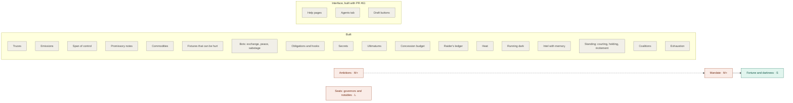

# Future features — a brainstorm from other games (2026-10-02)

Mechanics borrowed from tabletop RPGs and 4X / grand strategy games. Each one is
scored against two things:

- **The setting.** A lawless outer rim, five powers who differ on every axis,
  raiders and creditors, fog, and a Rim that moves on its own.
- **The architecture.** The model narrates; the reducer is the only thing that
  changes the world. That gives five tests:
  1. a closed vocabulary rather than a free-form field;
  2. code owns every number;
  3. the change replays from the journal;
  4. it respects the fog;
  5. it does not add a model call to every turn.

None of this is a commitment. It is a list to argue with, ordered so the cheap,
well-fitting ideas surface first.

**Built** (journal version 12): truces (§2.1), emissions (§3.5), a span of
control (§2.5), promissory notes (§1.2), commodities (§1.3) and fixtures that can
be hurt (§6.3). CLAUDE.md holds what each became; two of them changed on the
way, and the notes beside §3.5 and §2.5 say how.

**Built** (journal version 13): obligations and hooks (§1.1), secrets (§3.2),
ultimatums (§2.3) and the concession budget (§1.4).

**Scores** are 1–5 for *setting fit* and *architecture fit*. **Size** is S
(an afternoon), M (an item like 121 or 124's mechanics) or L (a subsystem like
assets or officers). **Gap** names the known hole in CLAUDE.md or `docs/todo.md`
an idea closes, where it closes one.

---

## The shortlist

| # | idea | borrowed from | setting | arch | size | gap it closes |
|---|---|---|---|---|---|---|
| 1 | **The raider's ledger**: bounties, protection, letters of marque | Sins of a Solar Empire, Distant Worlds, Starsector, Pirates of Drinax | 5 | 5 | M | Drajk's thin economy; nothing pays a raider to work against a named enemy |
| 2 | **Obligations and hooks** — a favour you can call in | Victoria 3, Crusader Kings III, Twilight Imperium | 5 | 4 | M | commitments with no mechanical home; "the debt is the instrument of control" |
| 3 | **Truces** after a war ends | Europa Universalis IV | 4 | 5 | S | *"What none of this does is let peace heal"* |
| 4 | **Ambitions** — sworn goals with progress and a reward | Old World, Stars Without Number, Ironsworn, Rogue Trader | 5 | 4 | M | campaigns trail off between wars; bots want things nobody can see |
| 5 | **Coalitions** against the power the Rim fears | Europa Universalis IV | 5 | 4 | S | *"nothing makes a hated power a coalition's target"* |
| 6 | **Secrets**: a watcher finds one, and a dossier becomes leverage | Crusader Kings III | 5 | 5 | M | a dossier has a price and no use |
| 7 | **Heat**: covert work and piracy make you notorious, and the Rim answers | Blades in the Dark / Scum and Villainy | 5 | 5 | M | — (extends the 124 pulse) |
| 8 | **Ultimatums with a clock** | Victoria 3 (diplomatic plays) | 4 | 4 | M | coercion has no structure; a demand and a war are the same act |
| 9 | **Courting unaligned worlds** | Pirates of Drinax, Endless Space 2 | 5 | 3 | L | neutral worlds are only garrisons to be taken |
| 10 | **Intel with memory** | Stellaris | 4 | 4 | M | *"Knowledge is a snapshot, not a memory"* |

Two pairs are better built together: **1 + 7** (heat is what a raider pays for
working without a commission) and **2 + 6** (a secret is the commonest way to
come by a hook).

---

## 1. Diplomacy and leverage

### 1.1 Obligations and hooks — *Victoria 3, Crusader Kings III, Twilight Imperium*

**Elsewhere.**
- *Victoria 3*: a country can become *obligated* to another, through a deal
  struck during a diplomatic play or by having its loans bought out. While it
  is obligated it cannot start a play against the holder or take the other side
  in one. The holder can call the obligation in to force a pact, or spend it to
  sway the country into its corner.
- *CK3*: **hooks** are leverage over a character. A weak hook can be used once;
  a strong one can be used repeatedly and stops the target acting against the
  holder.
- *Twilight Imperium*: **promissory notes** are tradeable tokens a player gives
  away, and the holder plays them later.

**Here.** An `Obligation { debtor, holder, strength: 'weak' | 'strong', origin,
expiresTurn }`, kept on `WorldState` beside debts.
- *Created* only where consent or proof exists:
  - an accord's concession ("I'll owe you one");
  - a debt bought or forgiven (Victoria's loan route — and the Combine's whole
    identity);
  - a secret used as blackmail (§3.2).
- *Called in* through a closed vocabulary, `call_obligation { kind }`, where
  `kind` is one of:
  - `stand_aside` — the debtor's bot may not attack the holder for N turns;
    `honourStanding` already has the shape for this;
  - `sign` — the debtor must accept one treaty type from a short list
    (`non_aggression`, `ceasefire`, `trade_accord`);
  - `support` — the debtor joins the holder's side of an ultimatum (§2.3).
- *Refusing* a called obligation is a breach, priced like `break_treaty`, and
  public.

**Fit.** Setting 5, architecture 4. The Combine's red lines ("will not forgive
an unpaid debt") get a positive mechanic beside the punitive one. It also gives
a persona real stakes: the state block says "you owe Meridian one". The risk is
models conjuring obligations, so creation stays extraction-only, and from a
declaration only through `forgive_debt` or a secret.

### 1.2 Promissory notes — each power's signature favour — *Twilight Imperium*

**Elsewhere.** Every faction holds a few notes it can give away. They are
generic (ceasefire, trade agreement, support) or unique to the faction, and only
the holder can play them.

**Here.** An `ASSET_ARCHETYPES` entry `promissory_note` with `uses: 1` and a
closed effect per power, written on the sheet:

| power | note | when played |
|---|---|---|
| Meridian | *Most-favoured terms* | the holder pays Meridian's best toll and price for N turns |
| Iron Vigil | *Escort of the Line* | a Vigil squadron defends one named world of the holder's for a battle |
| Ojjul Nar | *Line of credit* | the holder may draw an advance up to X from the Combine, as a `Loan` |
| Arkane | *Sanctuary* | one of the holder's fleets may stand in Drift space untouched for N turns |
| Drajk | *Safe passage* | Drajk raids nothing the holder ships for N turns |

**Fit.** Setting 5, architecture 5: assets, `uses` and `consume_asset` already
exist. One thing on this list is filed as unrepresentable — the
most-favoured-nation ratchet (`todo.md` B-12), because no arrangement can read
another's terms. A *note* makes a weaker version representable without that
recursion: it fixes the terms when it is played. Size M.

### 1.3 Commodities that only pay when given — *Twilight Imperium*

**Elsewhere.** Each faction replenishes *commodities* that are worth nothing to
it. Handed to another player they become trade goods. A *Trade Agreement* note
sends the giver's commodities to the holder automatically whenever they
replenish.

**Here.** A fixture or a world produces `commodity` stock worth 0 to its holder
and N credits to anyone else, the asymmetry assets already model. A
`trade_accord` could name one party's commodity flow to the other. That gives
every pair of powers a positive-sum reason to stay at peace. Today almost every
mechanic between powers is a cost.

**Fit.** Setting 4, architecture 5 (conserved, read where used). Size M. It
would move the 58/42 income mix, so it needs the harness.

### 1.4 A concession budget — *Burning Wheel's Duel of Wits*

**Elsewhere.** An argument has hit points (the *body of argument*), and the
winner must still offer a compromise sized by how much of their own body they
lost.

**Here.** A persona's concessions are free text checked after the fact, and
CLAUDE.md notes personas are *"measurably agreeable under pressure"*. A
**concession budget** per channel would be computed in code from:
- the other side's influence;
- disposition;
- leverage: obligations held, fleets in orbit (`underDuressFrom`), debts owed.

The budget is stated in the persona prompt ("you may give up about this much"),
and `groundInConcessions` trims anything over it. Code owns how much ground; the
model owns the words.

**Fit.** Setting 4, architecture 3: it is a prompt-plus-guard pair, and
"how much" needs a common unit (credits-equivalent). Size M. Worth a playtest
first, to see whether over-concession is still real since the schema-honesty
work.

---

## 2. War and its aftermath

### 2.1 Truces — *Europa Universalis IV*

**Elsewhere.** A peace imposes a truce. Nobody under truce can join a coalition
against the other party, and breaking a truce is one of the most expensive
diplomatic acts in the game.

**Here.** This is the narrowest fix for a gap CLAUDE.md states outright: a
war-ending ceasefire *"buys no standing at all"*, and a treaty with a duration
is *"a war on a timer"*.
- A treaty that ends a war (`ceasefire` or `cession`, signed while `warsFor`
  lists the pair) carries `truceUntil = turn + N`.
- While it holds, `warsFor` excludes the pair and the bots' `honourTreaties`
  withholds attacks.
- Each turn of kept truce moves each side's view of the other one point
  **toward −59** (just out of war) and no further. That heals the war without
  touching the documented ratchet anywhere else.
- Breaking a truce costs `PACT_BREAKING_REPUTATION_COST` doubled, with everyone.

**Fit.** Setting 4, architecture 5. Size S. It needs a journal-version pin. It
might move the board, since the Vigil–Drajk war could settle.

### 2.2 Coalitions — *Europa Universalis IV*

**Elsewhere.** *Aggressive expansion* is a relations penalty from taking land
that decays slowly. When enough independent countries share a deep enough
grudge and none has a truce with the aggressor, they form a coalition and fight
it together.

**Here, restated (2026-10-07).** A coalition is not a new record. It is
`mutual_defense` pacts among powers that share an enemy — bilateral, so three
members are three pacts, which the schema already says is how multilateral
pacts are made — plus bots that sign them. Read as built, the pact cannot carry
one, for four reasons:

1. **It never makes a co-belligerent.** `resolveBattle` draws the ally's
   `shipsPledged` into the one battle and that is all: `warsFor` reads
   disposition, and the attack charges only the holder's regard and onlookers'.
   The turn after its hulls were shot at, the ally is at peace with the
   attacker. **Fix:** a call to arms — each ally's regard for the attacker goes
   to `WAR_DISPOSITION_THRESHOLD` where it was warmer, the move the ultimatum
   deadline already makes — except an ally at peace or under truce with the
   attacker, who is not called. That exception is also how a coalition breaks
   up: a member that makes a separate peace stops being called.
2. **It is against everyone.** A coalition is against one power; a pact today
   obliges Meridian to defend Drajk against the Vigil as much as against the
   Nars, and an ally's hulls fight a power it has a ceasefire with.
   **Fix:** the pact names whom it is against. `mutualDefenseTrigger` is a free
   string nothing reads; it becomes a list of faction ids, empty meaning anyone.
3. **The pledge sends the wrong ships, from the wrong places, without limit.**
   It is a hull count drawn by `takeHulls` in loss order, so escorts, freighters,
   lifters and listeners go first; from the ally's largest stacks anywhere,
   across the map in an instant, its own fronts included; and again for every
   world attacked, every turn, with nothing going home. **Fix:** pledge
   warships in battleship-equivalents, the unit the exchange and the bots
   already use; draw only from worlds within reach of the one attacked; once a
   turn per pact.
4. **Nobody signs one.** A bot rule in `brokeredAccords`: two powers on good
   terms, both at war with or deeply hostile to the same third and neither at
   peace with it, sign a `mutual_defense` against it with warships pledged each
   way.

What needs nothing: fighting together. Arrivals at one world on one turn are
already one coalition battle, and once (1) puts the members at war,
`GRIEVANCE_WEIGHT` sends them at the enemy and `honourTreaties` keeps them off
each other.

**Built (2026-10-07)**, as a treaty type of its own: `coalition`, with
`terms.against` required on it and refused on everything else, beside a
`mutual_defense` that answers anyone. All four fixes landed, pinned to journal
version 19, with two departures. The pledge stays a hull count, drawn as
warships with battleships first, rather than battleship-equivalents, so the
promissory escort note and every prompt keep their meaning. And a profiteer
never joins, because a coalition is a promise to be at war. So no coalition
forms in the harness, and `tests/coalition.test.ts` is where it is measured.
See CLAUDE.md, *"Allies answer"*.

**Fit.** Setting 5, architecture 5. Size S. The frozen-board risk remains, so
the signing threshold needs sweeping like `BOT_AGGRESSION_CEILING` was. Truces
are still its release valve.

### 2.3 Ultimatums with a clock — *Victoria 3*

**Elsewhere.** A *diplomatic play* is a demand that escalates through three
phases toward war. During the middle phase both sides sway third parties with
promises (obligations, a share of the war goals). At the end the target backs
down or there is war.

**Here.** A `Demand { from, to, terms (a treaty type from a closed list),
deadlineTurn, backers }`.
- *Before the deadline*: the target can concede in a channel and sign. Third
  parties can declare for a side, by obligation (§1.1) or by an accord.
- *At the deadline*: unanswered, disposition is set to war (`warsFor`), the
  backers' `mutual_defense` fires, and the bots respond.
- Personas see the clock: *"the Vigil has two turns to answer you"*.

**Fit.** Setting 4, architecture 4. Size M. It splits coercion from war, which
today are one act. `COERCION_RESENTMENT` already prices the signature a demand
extracts.

### 2.4 Exhaustion — *Europa Universalis IV, Stellaris*

**Elsewhere.** Long wars build *exhaustion*, which pushes rulers toward peace.

**Here, restated (2026-10-07).** War goals are dropped: a war here starts from
disposition or an ultimatum, and an ultimatum already names what it is for.
Exhaustion is bots weighing whether they can afford their wars when they decide
on peace — today they make peace only on a quiet war (`ENVOYS_QUIET_TURNS`
without a battle), never on a losing one.

**A position check, not a per-war ledger.** A power fighting three enemies
may need to settle with one in order to hold against the others, and a ledger
of what each war cost cannot see that. What decides it is the whole position:
the power's battle line against every enemy's combined (`sideStrength` over
`warsFor`, which ultimatums already read), and whether its treasury and net can
carry the fight. All of it is on the board, so nothing new is recorded.

- **A bot sues** when it is outmatched or its money is running out — with the
  enemy whose peace frees the most, so it consolidates against the rest.
- **The terms follow the position.** The weaker side pays: an indemnity
  (`terms.payment`) sized from its treasury, or a cession of what the other
  already holds.
- **The persona reads it.** Being outmatched is leverage, so
  `concessionBudget` can count it.

**Fit.** Setting 4, architecture 5. Size S. No journal pin: it reads state, and
bot ops are journaled.

**Built (2026-10-07).** Outmatched means enemies at two to one, the battle's
break-off odds. 1.5, the ultimatum ratio, was swept and sends the Vigil to
eight worlds by turn 100. Broke means running at a loss with under five turns
of savings. The indemnity is a quarter of the treasury. All four harness boards
are unchanged; the Vigil sues Meridian twice. See CLAUDE.md, *"Exhaustion"*.

### 2.5 A span of control — *Terra Invicta, Europa Universalis IV (overextension)*

**Elsewhere.** *Terra Invicta*'s control-point cap is set by councillor stats.
It is a soft cap: going over costs more each turn rather than forbidding the
expansion.

**Here.** `OCCUPATION_COST` already charges for foreign ground. A soft
**administrative cap** from influence would add dissent for each world held
beyond it. It is a brake on runaway expansion, like the rally, that reads a stat
nobody else reads on the attacking side.

**Fit.** Setting 3, architecture 5. Size S. Low priority: the occupation sweep
showed this kind of lever is a cliff, and one already exists.

**As built.** Never less than the homeland, read off influence before dissent so
it cannot spiral, and a base of 5 rather than 6 — at 6 it never fired in the
harness.

---

## 3. Covert work and intelligence

### 3.1 Intel with memory — *Stellaris*

**Elsewhere.** An envoy builds a spy network in another empire. Infiltration
grows over time and passively yields *intel*: a level per empire that decides
how much of it you can see, unlocking operations at thresholds.

**Here.** CLAUDE.md files the simplification by name: *"Knowledge is a snapshot,
not a memory … a last-known-position model is the more honest one."*
- `Intel[viewer][target]` from 0 to 100 grows each turn from:
  - watchers and listeners on the target's ground;
  - live trade accords;
  - officers who fought them.
- It decays slowly. Thresholds reveal, in order: fleet totals, then rumours
  upgraded to their order type, then the target's treasury, then its covert
  stat debuffs.
- **Last seen** rows keep what an operative saw after it is burned, greyed and
  dated.

**Fit.** Setting 4, architecture 4: it needs durable state and fog code. Size M.

### 3.2 Secrets — *Crusader Kings III*

**Elsewhere.** A spymaster finds a character's *secrets*: crimes, shames,
affairs. A secret can be exposed to hurt them, or held to gain a hook.

**Here.** A watcher (`intel` effect) on a rival's ground has a chance each tick
to uncover a **secret** typed from state, never invented:
- a red line the rival crossed in private;
- a covert operation of theirs (one of their unexposed agents);
- a treaty clause they are quietly violating (an unpaid tribute, a defaulted
  debt);
- a hidden fleet programme.

It is minted as a `dossier` asset carrying `secretKind`. Two new uses:
- `publish_dossier` hits the subject's standing with every onlooker, sized by
  kind;
- `blackmail` turns it into a strong hook (§1.1) and spends it.

**Fit.** Setting 5, architecture 5. A dossier today is *"paper with a price and
no use"*; this gives it one. Discovery is a seeded roll and the facts come from
state. Size M.

### 3.3 Heat and entanglements — *Blades in the Dark / Scum and Villainy*

**Elsewhere.** A crew's jobs build *heat*. Heat rolls up into a *wanted level*,
and after each job the GM rolls entanglements from a table chosen by that level:
reprisals, questioning, rivals, flipped contacts.

**Here.** `Heat[power]` rises with:
- covert operations (more for assassination);
- raids without a commission (§4.1);
- breaking pacts;
- false-flag work (§3.4).

It decays slowly. The 124 pulse gains **notoriety events**, eligible above heat
thresholds and weighted by heat:
- a **crackdown** — hostile counter-intelligence on your operatives' worlds;
- a **bounty posted on you** — §4.1, paid by a rival's merchants;
- a **turned contact** — one of your operatives defects;
- a **show of force** — a power's fleet parks on your border.

Each one is built from a mechanic that exists, as the ten events were.

**Fit.** Setting 5, architecture 5. Size M. It turns reputation costs that are
today flat and immediate into a pressure that builds and breaks. Measuring needs
the bots to raid, which Drajk's do.

**As built.** Heat decays one a turn and every notoriety event that lands sheds
fifteen. Published proof heats its subject by what the scandal costs it. The
merchants' bounty is minted, one turn of the target's gross, and nobody can
withdraw it. A turned contact also files proof of one more of its old masters'
secrets. A show of force moves up to sixteen tons of the neighbour's own hulls
to the border; it is not an ultimatum. Notoriety events take turns from the ten
fortunes rather than adding to the rate.

### 3.4 Running dark — *Starsector (the transponder)*

**Elsewhere.** Turning the transponder off lets a fleet trade on the black
market and act without attribution. If it is identified anyway, reputation
takes the hit.

**Here.** `commerce_raiding` or `fleet_movement` with `dark: true`:
- no `PIRACY_REPUTATION_COST` up front;
- each turn the victim rolls guile against the raider's guile — the operative
  contest, reused;
- on a hit the raid is unmasked: full cost, doubled, plus heat.

The fleet itself is still visible (`system.ships`); only *whose* is withheld
from onlookers, as a rumour is.

**Fit.** Setting 5, architecture 4: the fog has to learn an anonymous stack.
Size M. It is a Drajk and Combine tool by doctrine.

### 3.5 Emissions — *HighFleet*

**Elsewhere.** Radar finds an enemy, and the emission betrays the radar. ELINT
detects the emissions at long range.

**Here.** Listeners today see orders where they stand. With **emissions**, a
fleet under way is detected by any listener within N jumps of its path, a turn
before arrival: early warning, the thing a listener should buy. A power that
sails no fleets is invisible to SIGINT.

**Fit.** Setting 3, architecture 5. Size S.

**As built.** Fleet movements are already public to everyone, so hearing them
would have added nothing. A listener instead hears the *hidden* work that runs
on hulls and yards — a raid and the four secret yard programmes — within two
jumps, and nothing done by people in rooms.

---

## 4. The economy of a lawless rim

### 4.1 The raider's ledger — *Sins of a Solar Empire, Distant Worlds, Starsector, Pirates of Drinax*

Three games price pirates three ways, and Pax Galactica has the pirates: the
Confederacy, and anyone who turns raider.

| contract | elsewhere | here |
|---|---|---|
| **Bounty** | *Sins*: each player funds a pool against a rival; the pirates raid whoever carries the largest pool, and destroying a ship pays out part of the pool | `bounties[target]`, escrowed credits. Raiders' bots and personas weight targets by bounty. Hulls destroyed and credits raided from the target pay out of the pool, conserved |
| **Protection** | *Distant Worlds*: pay a pirate faction monthly and it leaves you alone; the more protection it sells, the stronger it grows | a `contract` treaty with typed `protection` terms: immune to the raider's raids, as a `trade_accord` is, for a fee per turn |
| **Letter of marque** | *Starsector*: a commission pays a stipend plus bounties for destroying the commissioning faction's enemies | a `contract` with `commission` terms: a stipend, plus a share of what is raided from named enemies. No `PIRACY_REPUTATION_COST` with the commissioner, and no raiding it |

**Why first.** Drajk is the power the last two changes had to rescue (the front
guard and its luck). Its doctrine is *"raid the rich"*, and these turn raiding
from a reputation drain into a business three counterparties can pay into. The
Combine's *"let other powers spend their fleets for you"* gets the one
instrument it lacks: a `Loan` hires a squadron under your own command, but
nothing pays a raider to work on its own account against a named enemy — which
is what a proxy actually is.

**Fit.** Setting 5, architecture 5. All three are conserved transfers, the bots
can read them, and all are typed terms on types that exist. Size M. It moves
Drajk's economy, so it needs measuring; the guard should be retuned or kept
after.

**As built.** Protection keeps the raider's blockades off as well as its raids.
Raid bounties are a line on the ledger, because as a bare transfer the
Confederacy read as insolvent while its treasury grew. The guard was kept:
without it the Confederacy falls to four worlds at 30 turns and three at 100.
Protection never fires in the harness, since the Combine commissions the
Confederacy before it would ever need to buy it off.

### 4.2 Speculative trade by world type — *Traveller* (dropped)

**Dropped.** Lane income is automatic and a freighter only modifies it, so a
cargo run would be a second trade economy beside the first. See
`design-2026-10-04.md`.

**Elsewhere.** Purchase and sale prices move with each world's trade codes,
starport and tech level, and a broker's skill shifts the price a few percent per
point of effect.

**Here.** A cargo asset bought at one world type and sold at another, with
prices from `worldType` plus the shortage factor, carried by freighters as a
`trade_run` order. Freighters would earn by choice, not only from lane
weighting.

**Fit.** Setting 4, architecture 4. It is micro-scale for a grand-strategy turn
and costs a declared action. Size M. Low priority.

### 4.3 Endeavours — *Rogue Trader*

**Elsewhere.** A ventures system: a multi-part enterprise earns *achievement
points* step by step, and completion raises the dynasty's *Profit Factor*.
Misfortunes are setbacks that can spiral.

**Here.** This is best folded into ambitions (§5.1) as their commercial kind:
open a charter at X, salvage the derelict field, build a hub. Each is a few
declared steps, and completion grants a permanent modest income or stat line.

---

## 5. Goals, legitimacy and character

### 5.1 Ambitions — *Old World, Stars Without Number, Ironsworn, Rogue Trader*

**Elsewhere.**
- *Old World*: a dynasty wins by fulfilling a ladder of *ambitions* drawn from
  its own events and characters.
- *SWN*: a faction picks a *goal* (Military Conquest, Commercial Expansion,
  Intelligence Coup, Blood the Enemy, Peaceable Kingdom…) and earns XP on
  completing it.
- *Ironsworn*: a *vow* has a rank, a progress track marked by milestones, and a
  reward sized to that rank.

**Here.** An `Ambition { factionId, kind, target, rank, progress, sworn,
deadline }`.
- `kind` is a closed list, each with a progress rule read off state:
  - hold N worlds of a sector;
  - bank N credits;
  - take world X;
  - end the war with Y on terms;
  - run N operatives;
  - raise N fixtures;
  - see Y's dissent above N.
- *Sworn* by the player as a declaration, or derived by a bot from doctrine (the
  Vigil's *"restore the Torrek"* is already one in all but name).
- *Fulfilled*: a reward by rank — dissent relief, a mandate point (§5.2), or a
  permanent stat point. *Abandoned or lapsed*: dissent, as a compulsion
  defied.
- **Public or private.** A power's sworn ambitions are rumours to the others
  until an operative reads them, so the fog has something new to sell.

**Fit.** Setting 5, architecture 4. Size M. It gives a 30-turn campaign an arc
the epilogue can narrate (*"swore to hold the Torrek, and did"*). It makes the
bots' wants legible to a player across the table. It also gives NPC personas
something they want beyond the turn.

### 5.2 Mandate — compels that pay, and orders from legitimacy — *Fate, Old World, Burning Wheel*

**Elsewhere.**
- *Fate*: when an aspect is *compelled*, a player who accepts the complication
  gains a fate point, and one who refuses must pay one.
- *Old World*: a ruler's *orders* each turn scale with *legitimacy*.
- *Burning Wheel*: *artha* for acting on beliefs.

**Here.** Compulsions are only ever a cost: dissent for defying them, drift for
ignoring them. **Mandate** is the positive half.
- Earned by acting on a compulsion when it fires (a trigger is true, and the
  turn's ops answer it — measurable) and by fulfilling an ambition.
- Spent on a third action this turn, or a reroll of one check.
- Capped low, and decaying, so it is a reward for being in character rather
  than a bank.

**Fit.** Setting 5, architecture 4. Every extra action is a model call
(~$0.07), so the cap is a cost decision as well as a design one. Size M.

### 5.3 Estates — *Europa Universalis IV, Victoria 3, Endless Space 2*

**Elsewhere.** A realm's *estates* (EU4) or *interest groups* (Victoria 3) each
have loyalty and influence. They want things, grant privileges, and revolt when
ignored. *Endless Space 2*'s senate passes laws by party strength.

**Here.** The sheets already name institutions: *the Trade Council*, *the fleet
commanders*, *the captains*. Making two per power explicit, each with loyalty
and owning some of the red lines and compulsions, would let a refusal anger one
group and please another. A leader could buy loyalty with privileges, which
would be typed modifiers.

**Fit.** Setting 5, architecture 3: this is a second layer over
dissent and prompt-heavy. Size L. Defer until ambitions and mandate show whether
one more axis of internal politics is wanted.

**Reworked (2026-10-07)** as **seats**: a third class of person, one per held
world. A notable is a local house with its own favour, and it carries dissent.
A governor is the leader's appointee, and it does not. See
`design-2026-10-07-seats.md`. Mandate is tabled, so seats no longer wait on it.

---

## 6. The Rim itself

### 6.1 Courting unaligned worlds — *Pirates of Drinax, Endless Space 2*

**Elsewhere.**
- *Pirates of Drinax*: a crew wins independent worlds to a fallen kingdom by
  trading with them, defending them from raiders, and meeting each world's own
  *desired policy*.
- *Endless Space 2*: minor factions have relations, assimilation and special
  actions.

**Here.** Five of the twenty-five worlds begin unaligned, and today they are
garrisons to be taken. Each would gain:
- a **want** from a closed list: protection (no raid on it for N turns), a
  link (a trade accord's lane through it), a hub (`strategicValue` ≥ 7), or
  arms (a garrison raised);
- an **opinion of each power**, moved by meeting its want and by raiding it.

Past a threshold it joins peacefully: a cession with no war, no occupation cost
(`homeFactionId` stays null), and its garrison intact. This is the non-violent
expansion the *defensive* and *free-trade* doctrines have no way to pursue.

**Fit.** Setting 5, architecture 3: a new state slice, bot behaviour and prompt
surface. Size L. Highest setting fit of the large items.

### 6.2 Fortune and darkness — *Coriolis*

**Elsewhere.** Praying to an icon rerolls failed dice, and every prayer gives
the GM a *darkness point* to spend on complications later.

**Here.** It extends §5.2. Spending mandate on a reroll adds **darkness** to
that power, which the pulse reads as weight on hazards aimed at it, the way
luck reweights them (`Faction.luck`). Good fortune bought now is trouble owed
later, which suits a Rim that moves on its own.

**Fit.** Setting 4, architecture 5. Size S once mandate exists.

### 6.3 Fixtures that can be hurt — *Stars Without Number*

**Elsewhere.** Every faction asset has hit points, a purchase cost, sometimes
upkeep, and can attack and counter-attack other assets.

**Here.** A fixture today is lost only with its world. Giving it a condition,
with `sabotage` operatives able to damage it and a repair programme to fix it,
gives covert work a target beyond hulls and makes a fixture worth guarding.

**Fit.** Setting 4, architecture 5. Size M.

---

## By size of build

What makes each size:
- **Small**: one rule in code that exists.
- **Medium, lighter**: new terms, archetypes or counters on structures that
  exist.
- **Medium, heavier**: a new slice of state, plus the bots, the fog or the
  prompts learning it.
- **Large**: a new subsystem.

Anything that moves money or the bots also needs a harness run, whatever its
size.

### Small

| idea | § | why it is small |
|---|---|---|
| Truces **(built)** | 2.1 | a field on the peace treaty, read by `warsFor` and the bots, plus bounded recovery |
| Emissions **(built)** | 3.5 | listeners also read fleets under way within N jumps |
| A span of control **(built)** | 2.5 | dissent per world over an influence-derived cap |
| Fortune and darkness | 6.2 | a weight on the pulse — small only once mandate exists |
| Exhaustion **(built)** | 2.4 | bots weigh their whole position — line and treasury against every enemy — when they sue and on what terms |
| Coalitions **(built)** | 2.2 | a `coalition` treaty type beside `mutual_defense`; both call allies to war and pledge warships within reach; bots sign them |

### Medium, lighter

| idea | § | what it builds on |
|---|---|---|
| The raider's ledger **(built)** | 4.1 | typed terms on `contract`, and an escrowed bounty pool |
| Secrets **(built)** | 3.2 | dossier kinds read off state, and two ops: publish and blackmail |
| Heat **(built)** | 3.3 | a decaying counter, and four events on the 124 pulse |
| Promissory notes **(built)** | 1.2 | an asset archetype with `uses: 1` and one effect per power |
| Fixtures that can be hurt **(built)** | 6.3 | a condition on fixtures, a sabotage effect and a repair programme |
| Commodities **(built)** | 1.3 | a non-paying fixture yield that pays the receiver |

### Medium, heavier

| idea | § | what is new |
|---|---|---|
| Obligations and hooks **(built)** | 1.1 | an obligation record, `call_obligation`, and the bots honouring it |
| Ambitions | 5.1 | an ambition record, progress rules per kind, bot-derived goals, fog |
| Ultimatums with a clock **(built)** | 2.3 | a demand record with a deadline, backers, and escalation in the tick |
| Mandate | 5.2 | earning on compulsions met, and a third action or a reroll |
| Intel with memory **(built)** | 3.1 | a per-pair intel level, thresholds in the fog, last-seen rows |
| Running dark **(built)** | 3.4 | anonymous stacks in the fog, and an unmasking contest |
| A concession budget **(built)** | 1.4 | a leverage figure in code, the persona prompt, the concession guard |
| Speculative trade **(dropped)** | 4.2 | prices by world type, a cargo run order |
| War goals **(dropped)** | 2.4 | — a war's purpose is its ultimatum |

### Large

| idea | § | why it is large |
|---|---|---|
| Courting unaligned worlds **(built)** | 6.1 | wants and opinions for every neutral world, peaceful joining, bot behaviour, prompts |
| Estates, reworked as seats | 5.3 | a third class of person per world — notables who carry dissent, governors who do not — see `design-2026-10-07-seats.md` |

---

## Build graph

*Updated after PR #61: coalitions and exhaustion were built as extensions of
mutual defence and bot peace, war goals were dropped, and the interface caught
up with what is built.* Seventeen ideas are built, plus the bot rules that use
them, and two are dropped, so four are left. Built work is no longer a node:
where it unlocks something, the node says so.

The interface work is not from this brainstorm and is drawn apart from it. It
makes the built ideas reachable in play rather than adding mechanics:
- help that is an index and a page per part of the game;
- an Agents tab that tracks the network;
- buttons that write the sentence for a recruit, an appointment, a fixture, a
  sale or a ransom, and never send it.

A solid arrow means the later idea, or one part of it, cannot be built without
the earlier one. A dashed arrow means it is better built after. Green is small
or lighter medium; red is heavier medium or large; grey is built.

S is small, M is medium (lighter), M+ is medium (heavier) and L is large.

**What each edge is.**

| edge | kind | why |
|---|---|---|
| mandate → fortune | needs | darkness is charged when mandate buys a reroll |
| ambitions ⇢ mandate | better after | a fulfilled ambition earns mandate |

**Waves.**

1. **Ready now:** ambitions, and seats (estates reworked; design written). Mandate is tabled.
2. Mandate.
3. Fortune and darkness.

The longest chain is three deep: ambitions → mandate → fortune.

The bots now reach the leverage layer too: they demand tribute of weaker
neighbours, keep watchers on rivals, and publish or blackmail with what those
find. They post bounties, commission raiders and buy protection, and the Rim
answers whichever of them runs hot. They also sue for peace when their enemies
together outweigh them two to one, or their wars outrun their savings. They
sign coalitions against a stronger power both members hate. The harness
measures all of it except two: protection, which it never reaches, and
coalitions, which no pair on the board qualifies for.

---

## Parallels already built

What the borrowing confirms, and what it found already done:

| elsewhere | here |
|---|---|
| Stellaris ethics, SWN Force / Cunning / Wealth | `warEthic` / `tradeEthic`; five stats |
| Reign's Sovereignty | `dissent` |
| Blades faction status −3…+3 | disposition −100…100, war at −60 |
| CK3 schemes and agents | operatives, missions and the exposure ladder |
| Stellaris recruit-then-operate | `recruit_agent` then `deploy_agent` (this week) |
| Starsector industries capped by colony size; Birthright's holding types | two fixtures a world, of different kinds (this week) |
| Twilight Imperium transactions | accords, `transfer_asset`, `terms.payment` |
| HighFleet ELINT | listeners |
| Fate compels | compulsions — the cost half; §5.2 adds the reward half |
| Victoria 3 loans | `Debt` and `Loan` |
| Terra Invicta control cap, EU4 overextension | `OCCUPATION_COST` |
| Old World / CK3 events | the 124 pulse, luck and sandboxes |

---

## Suggested order

*Updated after the raider's ledger and heat.* The Confederacy now has an
economy — five worlds where it held three — and the front guard was measured
and kept.

1. **Ambitions** (§5.1), then **mandate** (§5.2) — the arc, and the reward for
   playing in character.
2. **Running dark** (§3.4) — heat is built, so an unmasked raid has a price to
   pay; the Confederacy and the Combine are its users by doctrine.
3. ~~Exhaustion~~ and ~~coalitions~~ — built 2026-10-07. War goals are dropped.

Every one of these would need a journal-version pin, a harness run, and a line
in `CLAUDE.md`'s conventions if it adds a vocabulary.

---

## Sources

- Stars Without Number factions — [Take on Rules](https://takeonrules.com/2018/12/27/lets-read-stars-without-number-factions/), [Prince of Nothing review](https://princeofnothingblogs.wordpress.com/2019/05/13/review-stars-without-number-pt-vi-breakfast-of-champions/)
- Twilight Imperium — [Transactions](https://tirules2.com/R_transactions), [Commodities](https://tirules2.com/R_commodities), [Promissory notes](https://www.yjmrobert.com/tirules/components/c_promissory_notes/)
- Victoria 3 — [Diplomatic play (wiki)](https://vic3.paradoxwikis.com/index.php?title=Diplomatic_play&mobileaction=toggle_view_desktop), [Dev Diary #21](https://forum.paradoxplaza.com/forum/threads/victoria-3-dev-diary-21-diplomatic-plays.1495892/)
- Europa Universalis IV — [Aggressive expansion](https://eu4.paradoxwikis.com/Aggressive_expansion), [Coalition](https://eu4.paradoxwikis.com/Coalition)
- Sins of a Solar Empire — [Bounty](https://sinsofasolarempire.fandom.com/wiki/Bounty)
- Starsector — [Colony](https://starsector.wiki.gg/wiki/Colony), [Industry](https://starsector.wiki.gg/wiki/Industry)
- Crusader Kings III — [Hooks](https://ck3.paradoxwikis.com/Hooks), [PC Gamer intrigue guide](https://www.pcgamer.com/crusader-kings-3-ck3-intrigue-hooks/)
- Blades in the Dark — [SRD](https://github.com/amazingrando/blades-in-the-dark-srd-content/blob/main/Blades-in-the-Dark-SRD.md), [Entanglements](https://bladesinthedark.com/entanglements)
- Rogue Trader — [Profit Factor & assets](https://rtlegacy.fandom.com/wiki/Profit_Factor_%26_Assets), [Endeavours thread](https://forum.rpg.net/index.php?threads/rogue-trader-rpg-the-thread-of-endeavors.488776/)
- Stellaris — [Dev Diary #197: Operations and Assets](https://store.steampowered.com/news/app/281990/view/3022446487043359757), [Intelligence](https://stellaris.fandom.com/wiki/Intelligence)
- Reign — [Greg Stolze's REIGN wiki](https://www.gregstolze.com/REIGNwiki.html)
- Old World — [Mohawk Games](https://mohawkgames.com/oldworld/), [Wikipedia](https://en.wikipedia.org/wiki/Old_World_(video_game))
- Traveller — [Trade (SRD)](https://www.traveller-srd.com/core-rules/trade/)
- Pirates of Drinax — [Gar Hanrahan](https://garhanrahan.com/2021/06/02/the-pirates-of-drinax/), [Introspective](https://hws3.wordpress.com/2021/03/30/pirates-of-drinax-introspective-2/)
- Birthright — [Wikipedia](https://en.wikipedia.org/wiki/Birthright_(campaign_setting)), [Regency point usage](http://www.birthright.net/forums/showwiki.php?title=Regency_point_usage)
- Fate — [Invoking & compelling aspects](https://fate-srd.com/fate-core/invoking-compelling-aspects)
- Burning Wheel — [Duel of Wits explained](https://forum.rpg.net/threads/explain-burning-wheels-duel-of-wits-to-me.760950/)
- Terra Invicta — [Control Point Capacity](https://wiki.hoodedhorse.com/Terra_Invicta/Control_Point_Capacity)
- Ironsworn: Starforged — [Quest moves](https://rsek.github.io/starforged-srd/moves/quest)
- Endless Space 2 — [Senate](https://endless-space-2.fandom.com/wiki/Senate)
- HighFleet — [Intelligence & recon guide](https://culturedvultures.com/highfleet-intelligence-recon-guide-radar-salvage/)
- Distant Worlds — [Protection discussion](https://steamcommunity.com/app/261470/discussions/0/616187839427623821)
- Coriolis — [Darkness points (EN World)](https://www.enworld.org/threads/coriolis-the-third-horizon.629682/)
